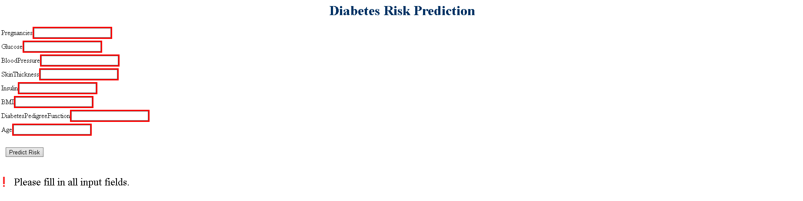

# Diabetes Risk Prediction

A machine learning project that predicts the likelihood of diabetes using patient health indicators from the Pima Indians Diabetes dataset. It features a web application built using Dash, allowing users to input patient information and receive predictions in real time.

---

## Table of Contents

- [Project Motivation](#-project-motivation)
- [Dataset Source](#-dataset-source)
- [Models Used & Rationale](#-models-used--rationale)
- [Model Performance Summary](#-model-performance-summary)
- [Project Structure](#-project-structure)
- [How to Run the Project](#️-how-to-run-the-project)
- [Requirements](#-requirements)
- [Future Work](#-future-work)

---

## Project Motivation

Diabetes is a growing global health concern, affecting over 400 million people worldwide. Early detection plays a crucial role in preventing severe complications such as heart disease, kidney failure, and vision loss.

This project aims to leverage machine learning to build a predictive model that can assess the risk of diabetes based on patient health metrics. The goal is to support healthcare providers and researchers in identifying high-risk individuals and improving early intervention strategies.

---

## Dataset Source

The dataset used in this project is the **Pima Indians Diabetes Database**, originally sourced from the **UCI Machine Learning Repository**, and also commonly available on [Kaggle](https://www.kaggle.com/datasets/uciml/pima-indians-diabetes-database).

Features include:
- Pregnancies
- Glucose
- Blood Pressure
- Skin Thickness
- Insulin
- BMI
- Diabetes Pedigree Function
- Age
- Outcome (Target: 0 or 1)

---

## Models Used & Rationale

### 1. Logistic Regression
- A simple and interpretable baseline model for binary classification.
- Useful for understanding feature influence through coefficients.

### 2. Random Forest Classifier
- Robust ensemble method that captures feature interactions.
- Offers high performance and feature importance scores.

---

## Model Performance Summary

| Metric        | Logistic Regression | Random Forest |
|---------------|---------------------|----------------|
| Accuracy      | 70.13%              | 77.92% |
| Precision     | 58.7%               | 72.73% |
| Recall        | 50.0%               | 59.26% |
| F1 Score      | 54.0%               | 65.31% |
| ROC-AUC       | 0.81               | 0.82 |

*Random Forest outperformed Logistic Regression in all key metrics.*

---

## Key Insights

- Glucose and BMI are among the strongest predictors
- Class imbalance is handled via stratified sampling
- Model interpretation is done using feature importance and confusion matrix

## Requirements

- pandas
- numpy
- matplotlib
- seaborn
- scikit-learn
- plotly

---

## Web Application
A simple and interactive Dash app is included. It allows users to:

Input medical information like Glucose, BMI, Age, etc.

Receive instant diabetes risk predictions using trained ML models.

---

## Project Structure

- data/ (Dataset(s))
- notebooks/ (Jupyter notebooks for EDA & modeling)
- models/ (Trained model files (e.g., model.pkl))
- app.py (Dash web application)
- requirements.txt (Project dependencies)
- README.md (Project documentation)

---

## How to Run the Project

### Clone the repo:

git clone https://github.com/Afonsofranca1/diabetes_risk_prediction.git
, cd diabetes_risk_prediction

### Install the dependencies:

pip install -r requirements.txt

### Run the app:

python app.py

### Open your browser at http://127.0.0.1:8050

---

## Application Preview

Here is a preview of the Diabetes Risk Prediction Dashboard:

---

## Future Work

- Hyperparameter tuning (GridSearch, RandomSearch)
- Use a real-world dataset (e.g., hospital patient data)

---

*If you found this project helpful, feel free to give it a star on GitHub!*

## Author

**Afonso França**  
Biomedical Engineer | Aspiring Data Scientist  
[afonsomanuelfranca@gmail.com]  
[www.linkedin.com/in/afonso-frança]  

